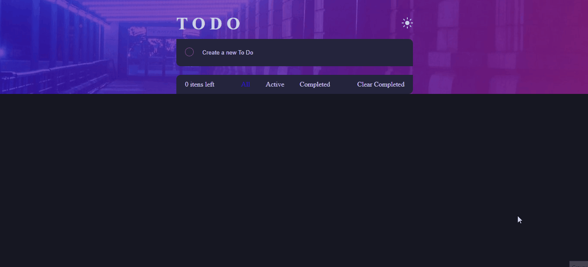

# ToDo Website

<h1 align="center">
    
</h1>

 

##

## Technologies:
+ HTML
+ JavaScript
+ React.js
+ Styled-Components
+ LocalStorage

#

 

## About:

 A task management website. It allows users to manage their tasks from a browser

The app can add 50 tasks, mark them as complete and delete completed tasks.
 

Tasks will be stored in the browser, allowing you to save their status.
 

The site offers two themes: light and dark. The user can switch between these themes.

#

 

><h2 align="center"> Application link:</h2>

 

<a target="_blank">
https://to-do-list-69f43.firebaseapp.com/
<a>